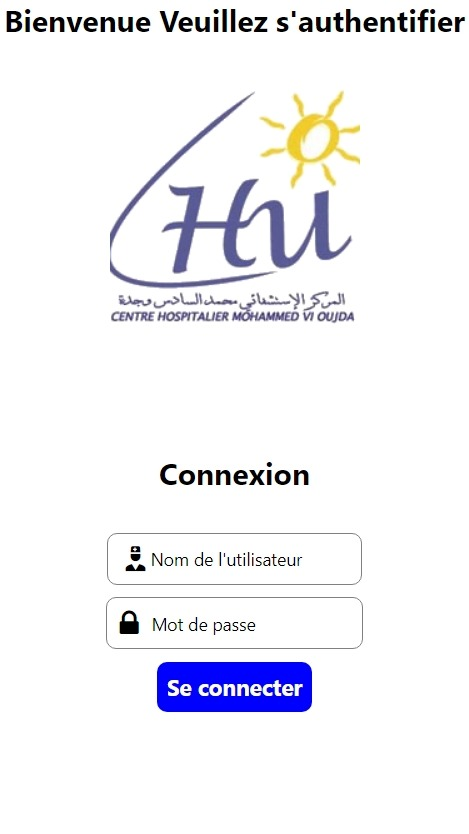
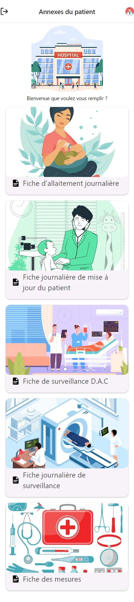
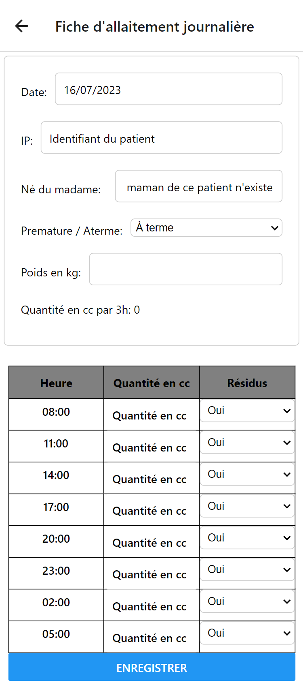
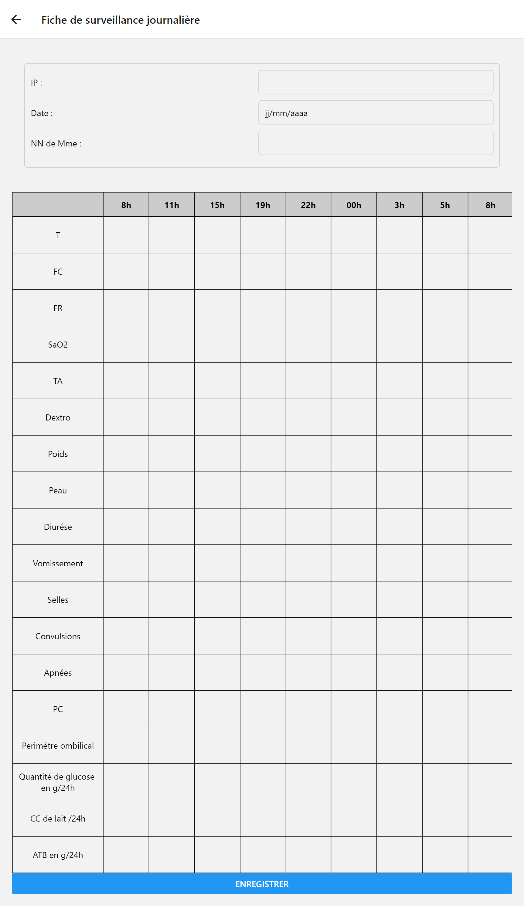
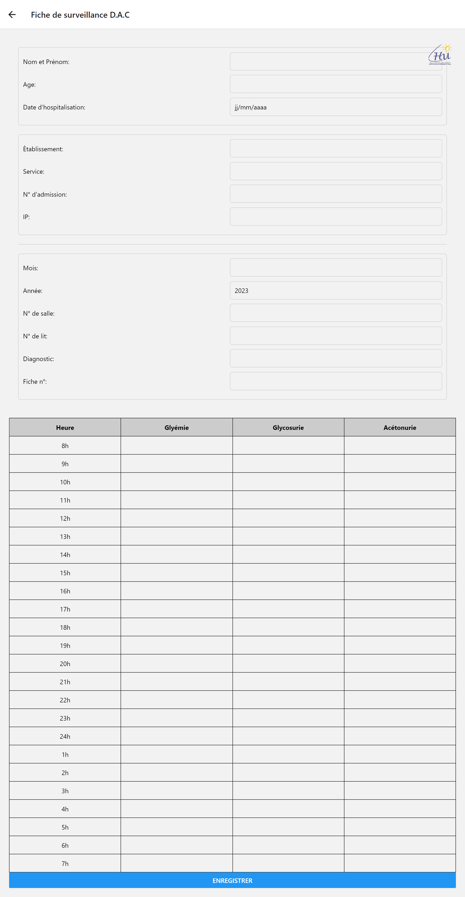
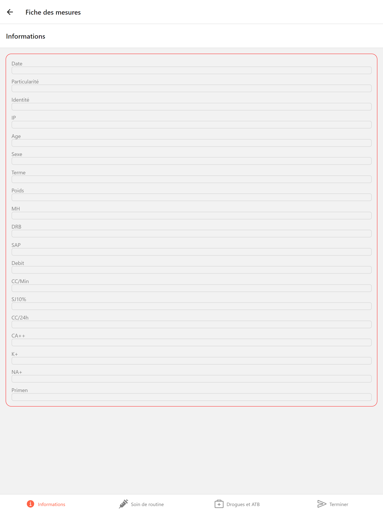
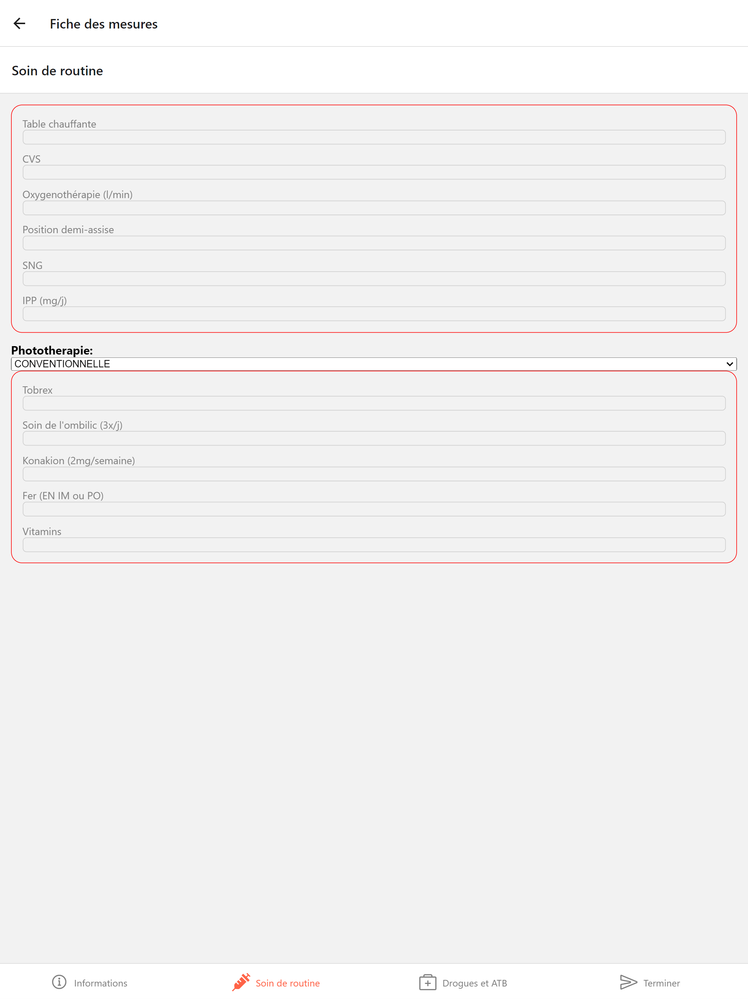
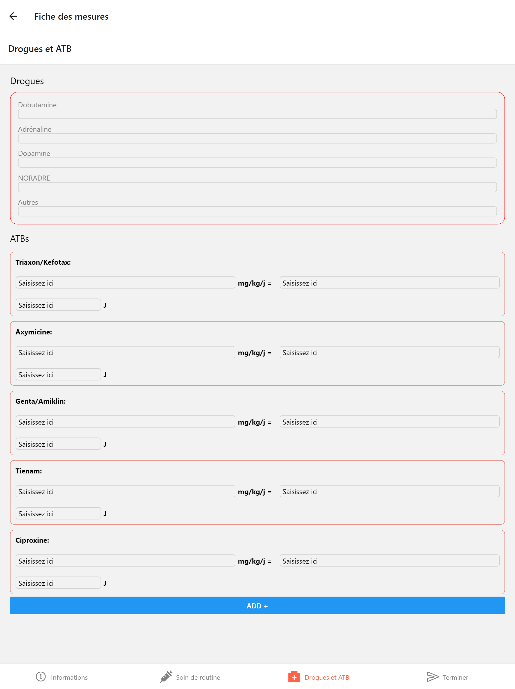

<!-- # Projet CHU Neonatale mobile

Projet qui vise à informatiser la gestion des informations des patient dans des annexes medicales .

 -->

 <div>
  

  
</div>

# DegiNeoNat

Application mobile cross platform qui informatise la gestion des annexes medicales des patients au service neonatale du centre universitaire hospitalier

## Technologies & Outils

**Client:** React Native , Expo, Axios

**Server:** Symfony , API PLATFORM , Docker

**Database:** MySQL

## Présentation et rapport de l’application et demonstration

[ Voir ici ](https://drive.google.com/drive/u/0/folders/13ADhPBIzSwF41a5F7SMFwly-PgCNRyAb)

## Features

- Mode plein écran : Permet de visualiser les informations médicales de manière plus détaillée en utilisant le mode plein écran pour faciliter la lecture et l'analyse.

- Plateforme multiplateforme : Développée avec des technologies cross-platform, permettant une compatibilité avec différents systèmes d'exploitation mobiles tels qu'Android et iOS

- Gestion des informations médicales : Permet aux professionnels de santé de saisir et de gérer les informations médicales des patients du service néonatal de manière numérique.

- Authentification utilisateur : Permet aux utilisateurs autorisés d'accéder à l'application en utilisant des identifiants sécurisés.

- Gestion des annexes médicales : Permet de gérer les différentes annexes médicales des patients, telles que les résultats de tests, les examens médicaux, les prescriptions, les antécédents médicaux, etc.

- Suivi des patients : Permet de suivre l'évolution des patients au fil du temps, d'enregistrer les données de croissance, les médicaments administrés, les allergies, les rendez-vous médicaux, etc.

## Screenshots
- Interface d'authentification 

 

- Interface principale qui contient les fiches à manipuler 



| Nom | Fiche  |
|--------------------|---------------------------------|
| Fiche d'allaitement|  |
| Fiche de mise à jour journalière du patient|  |
| Fiche de surveillance|  |
| Fiche de diagnostique acidocétose| 
 |


<!-- - Fiche de diagnostique acidocétose

 -->


- Fiche des mesures (Page en en tab)

| Mesure             | Image                                                        |
| ------------------ | ------------------------------------------------------------ |
| Partie I           |       |
| Partie II          |      |
| Partie III         |     |

<!-- ## Installation

Install my-project with npm

<!-- ```bash
  npm install DegiNeoNat
  cd DegiNeoNat
``` -->


